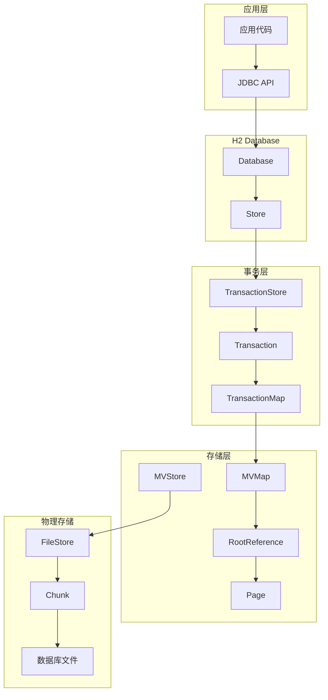
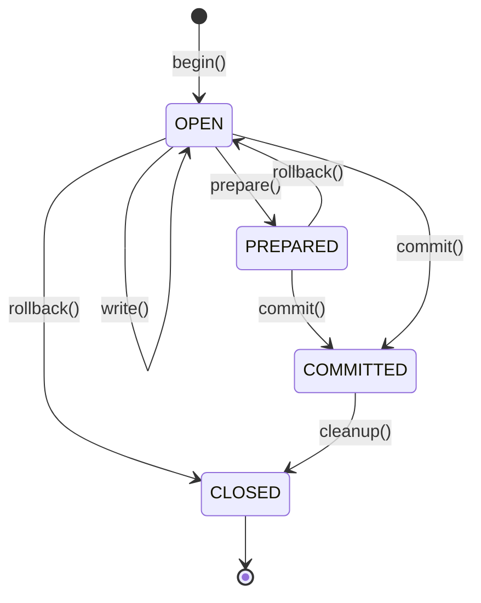

# MVStore 架构详解

## 一、MVStore 概述

MVStore 是 H2 Database 的核心存储引擎，基于 **多版本 B+Tree (MVCC B+Tree)** 和 **Copy-on-Write** 机制实现。它提供了：

- **高性能读写**：支持并发读写操作
- **事务支持**：通过 TransactionStore 实现完整的 ACID 事务
- **版本管理**：支持多版本并发控制（MVCC）
- **持久化存储**：基于 Chunk 的文件存储结构
- **压缩支持**：支持页面压缩（LZF、Deflate）

## 二、核心设计理念

### 2.1 基础架构

MVStore 基于 **B+Tree** 和 **Copy-on-Write** 机制：

```
┌─────────────────────────────────────────────────────────────────┐
│                         MVStore                                   │
│  ┌─────────────────────────────────────────────────────────────┐│
│  │                    RootReference (版本控制)                  ││
│  │  ┌───────────────────────────────────────────────────────┐  ││
│  │  │  version N ──→ version N-1 ──→ version N-2 ──→ ...    │  ││
│  │  │       │            │            │                    │  ││
│  │  │   rootPage     rootPage     rootPage                 │  ││
│  │  └───────────────────────────────────────────────────────┘  ││
│  └─────────────────────────────────────────────────────────────┘│
│                        ↓                                         │
│  ┌─────────────────────────────────────────────────────────────┐│
│  │                     MVMap (键值映射)                         ││
│  │  ┌───────────────────────────────────────────────────────┐  ││
│  │  │  Root Page (B+Tree 根节点)                             │  ││
│  │  │       ├─ Internal Node 1 (内部节点)                    │  ││
│  │  │       │   ├─ Internal Node 2                          │  ││
│  │  │       │   │   └─ Leaf Page (叶子页，存储数据)          │  ││
│  │  │       │   └─ Leaf Page                                │  ││
│  │  │       └─ Leaf Page                                    │  ││
│  │  └───────────────────────────────────────────────────────┘  ││
│  └─────────────────────────────────────────────────────────────┘│
│                        ↓                                         │
│  ┌─────────────────────────────────────────────────────────────┐│
│  │                    FileStore (文件存储)                      ││
│  │  ┌───────────────────────────────────────────────────────┐  ││
│  │  │  Chunk 1 ── Chunk 2 ── Chunk 3 ── ... ── Chunk N      │  ││
│  │  │  (数据块)  (数据块)  (数据块)           (数据块)        │  ││
│  │  └───────────────────────────────────────────────────────┘  ││
│  └─────────────────────────────────────────────────────────────┘│
└─────────────────────────────────────────────────────────────────┘
```

### 2.2 Copy-on-Write 机制

```
写入操作流程：

    初始状态 (Version 1)           修改 Page B (Version 2)
    ┌─────────────┐               ┌─────────────┐
    │   Root      │               │   Root'     │  ← 新的 Root 引用
    │   Page A    │               │   Page A    │  ← 未修改，共享
    │   Page B    │               │   Page B'   │  ← Copy-on-Write
    │   Page C    │               │   Page C    │  ← 未修改，共享
    └─────────────┘               └─────────────┘

    原有的 Page B 仍然可以被读取旧版本的客户端访问
```

## 三、核心组件架构

### 3.1 组件关系图



### 3.2 类层次结构

```
MVStore
│
├─ FileStore (抽象基类)
│  ├─ RandomAccessStore
│  │  ├─ SingleFileStore (单文件存储)
│  │  └─ OffHeapStore (堆外内存存储)
│  └─ AppendOnlyMultiFileStore (追加多文件存储)
│
├─ MVMap<K,V> (B+Tree Map)
│  └─ RootReference<K,V> (版本控制)
│     └─ Page<K,V> (B+Tree 节点)
│        ├─ LeafPage (叶子节点)
│        └─ NonLeafPage (非叶子节点)
│
├─ Chunk<C> (数据块)
│  ├─ SFChunk (单文件块)
│  └─ MFChunk (多文件块)
│
└─ TransactionStore (事务存储)
   ├─ Transaction (事务)
   ├─ TransactionMap<K,V> (事务 Map)
   └─ MVMap<K,VersionedValue<V>> (版本化 Map)
```

## 四、详细架构分析

### 4.1 MVStore - 存储引擎核心

**职责**：
- 管理多个 MVMap
- 版本控制和 MVCC
- 持久化和恢复
- 内存管理

**核心字段**：
```java
public final class MVStore {
    private final FileStore<?> fileStore;        // 底层文件存储
    private final MVMap<String, String> meta;    // 元数据 Map
    private final ConcurrentHashMap<Integer, MVMap<?, ?>> maps;  // 所有 Map
    private final AtomicInteger lastMapId;       // 最后的 Map ID
    private int versionsToKeep;                  // 保留版本数
    private final int compressionLevel;          // 压缩级别
}
```

### 4.2 MVMap - 多版本 B+Tree

**结构**：
```
MVMap
│
├─ AtomicReference<RootReference<K,V>> root  // 根引用（版本控制）
├─ DataType<K> keyType                        // 键类型
├─ DataType<V> valueType                      // 值类型
├─ int keysPerPage                           // 每页键数
└─ K[] keysBuffer / V[] valuesBuffer         // 缓冲区（单写模式）
```

**B+Tree 结构**：
```
                    ┌─────────────────┐
                    │  Root Page      │
                    │  [keys: A, D]   │
                    └────────┬────────┘
                             │
              ┌──────────────┼──────────────┐
              ↓              ↓              ↓
        ┌──────────┐  ┌──────────┐  ┌──────────┐
        │ Internal │  │ Internal │  │ Leaf     │
        │ [A, B]   │  │ [D, E]   │  │ [G, H, I]│
        └────┬─────┘  └────┬─────┘  └──────────┘
             │             │
             ↓             ↓
        ┌──────────┐  ┌──────────┐
        │ Leaf     │  │ Leaf     │
        │ [A, B, C]│  │ [D, E, F]│
        └──────────┘  └──────────┘
```

### 4.3 Page - B+Tree 节点

**页面类型**：
- **Leaf Page**：存储键值对
- **Non-Leaf Page**：存储键和子页面引用

**Page 结构**：
```java
public abstract class Page<K,V> {
    public final MVMap<K,V> map;           // 所属 Map
    private volatile long pos;             // 在 Chunk 中的位置
    public int pageNo;                     // 页面编号
    private K[] keys;                      // 键数组
    private V[] values;                    // 值数组（叶子页）
    private Page<K,V>[] children;          // 子页面（非叶子页）
    private int memory;                    // 内存占用
    private int diskSpaceUsed;             // 磁盘空间占用
}
```

**序列化格式**：
```
┌──────────────────────────────────────────────┐
│ Length (int)  - 页面总长度                    │
├──────────────────────────────────────────────┤
│ Checksum (short) - 校验值                    │
├──────────────────────────────────────────────┤
│ PageNo (varInt) - 页面编号                   │
├──────────────────────────────────────────────┤
│ MapId (varInt) - Map ID                      │
├──────────────────────────────────────────────┤
│ KeyCount (varInt) - 键数量                   │
├──────────────────────────────────────────────┤
│ Type (byte) - 页面类型                       │
│   0: leaf, 1: node, +2: compressed          │
├──────────────────────────────────────────────┤
│ Children (varInt[]) - 子页面位置（非叶子页）  │
├──────────────────────────────────────────────┤
│ CompressedSize (varInt) - 压缩后大小          │
├──────────────────────────────────────────────┤
│ Keys - 键数据                                │
├──────────────────────────────────────────────┤
│ Values - 值数据（叶子页）                     │
└──────────────────────────────────────────────┘
```

### 4.4 RootReference - 版本控制

**作用**：通过不可变对象实现原子性的版本切换

```java
public final class RootReference<K,V> {
    public final Page<K,V> root;              // 根页面
    public final long version;                // 版本号
    private final byte holdCount;             // 锁计数
    private final long ownerId;               // 锁拥有者线程 ID
    volatile RootReference<K,V> previous;     // 前一版本
    final long updateCounter;                 // 更新计数
    private final byte appendCounter;         // 追加计数
}
```

**版本链**：
```
Version 3 (current)
    └─ RootReference(root=Page3, version=3)
        └─ previous → Version 2
            └─ RootReference(root=Page2, version=2)
                └─ previous → Version 1
                    └─ RootReference(root=Page1, version=1)
                        └─ previous → null
```

### 4.5 FileStore - 文件存储抽象

**架构层次**：
```
FileStore<C extends Chunk<C>> (抽象基类)
    │
    ├─ RandomAccessStore extends FileStore<SFChunk>
    │   ├─ SingleFileStore extends RandomAccessStore
    │   │   └─ 存储：单个 .mv.db 文件
    │   │
    │   └─ OffHeapStore extends RandomAccessStore
    │       └─ 存储：堆外内存 (DirectByteBuffer)
    │
    └─ AppendOnlyMultiFileStore extends FileStore<MFChunk>
        └─ 存储：多个追加文件
```

### 4.6 Chunk - 数据块

**Chunk 结构**：
```
┌────────────────────────────────────────────────────┐
│  Chunk Header (可变长度，最大 1024 字节)            │
│  ┌──────────────────────────────────────────────┐  │
│  │ chunk:12345                                  │  │
│  │ block:0                                      │  │
│  │ len:1024                                     │  │
│  │ pages:100                                    │  │
│  │ pinCount:0                                   │  │
│  │ max:1048576                                  │  │
│  │ map:5                                        │  │
│  │ root:0                                       │  │
│  │ time:1000                                    │  │
│  │ version:10                                   │  │
│  │ next:0                                       │  │
│  │ toc:123                                      │  │
│  └──────────────────────────────────────────────┘  │
├────────────────────────────────────────────────────┤
│  Table of Contents (ToC)                           │
│  ┌──────────────────────────────────────────────┐  │
│  │ [page0:mapId,offset,len,type]               │  │
│  │ [page1:mapId,offset,len,type]               │  │
│  │ [page2:mapId,offset,len,type]               │  │
│  │ ...                                          │  │
│  └──────────────────────────────────────────────┘  │
├────────────────────────────────────────────────────┤
│  Page 0                                            │
├────────────────────────────────────────────────────┤
│  Page 1                                            │
├────────────────────────────────────────────────────┤
│  ...                                               │
├────────────────────────────────────────────────────┤
│  Page N                                            │
├────────────────────────────────────────────────────┤
│  Chunk Footer (固定 128 字节)                      │
│  ┌──────────────────────────────────────────────┐  │
│  │ chunk:12345                                  │  │
│  │ len:1024                                     │  │
│  │ version:10                                   │  │
│  │ fletcher:12345678                            │  │
│  └──────────────────────────────────────────────┘  │
└────────────────────────────────────────────────────┘
```

**Chunk 元数据**：
```java
public abstract class Chunk<C extends Chunk<C>> {
    public final int id;           // Chunk ID
    public volatile long block;    // 起始块号
    public int len;                // 长度（块数）
    public int pageCount;          // 页面总数
    public int pageCountLive;      // 活跃页面数
    public long maxLen;            // 最大长度
    public long maxLenLive;        // 活跃数据长度
    public int collectPriority;    // GC 优先级
    public long version;           // 版本号
    public long time;              // 创建时间
    public long unused;            // 不再使用时间
    BitSet occupancy;              // 页面占用位图
}
```

## 五、事务层架构

### 5.1 TransactionStore 组件

```
TransactionStore
│
├─ MVStore store                          // 底层存储
├─ MVMap<Integer, Object[]> preparedTransactions  // 准备好的事务
├─ MVMap<Long, Record<?,?>>[] undoLogs     // 撤销日志
├─ AtomicReference<VersionedBitSet> openTransactions  // 打开的事务
├─ AtomicReference<VersionedBitSet> committingTransactions  // 提交中的事务
└─ AtomicReferenceArray<Transaction> transactions  // 事务数组
```

### 5.2 事务生命周期



### 5.3 MVCC 实现原理

**VersionedValue 结构**：
```java
// 数据值版本化
Value: {
    value: "actual_data",
    transactionId: 10,
    operationId: 100,
    committed: true
}

// 读操作：
1. 读取当前 VersionedValue
2. 如果 committed=true 或 transactionId 在 committingTransactions 中，返回
3. 否则读取旧版本（通过 previous 引用链）
```

**读隔离级别**：
```
┌───────────────────────────────────────────────────────┐
│                事务隔离级别                             │
├───────────────────────────────────────────────────────┤
│                                                       │
│  Read Committed (读已提交)                             │
│    - 每次语句读取最新已提交版本                         │
│    - 不保证可重复读                                    │
│                                                       │
│  Repeatable Read (可重复读)                            │
│    - 事务开始时建立快照                                │
│    - 整个事务读取同一快照                              │
│                                                       │
│  Serializable (可序列化)                               │
│    - 检测并阻止并发修改冲突                            │
│                                                       │
└───────────────────────────────────────────────────────┘
```

## 六、数据读写流程

### 6.1 写操作流程

```
Client Request: map.put(key, value)
        ↓
TransactionMap.put()
        ↓
检查事务状态和隔离级别
        ↓
加锁（根据隔离级别）
        ↓
TransactionStore.beginStatement()
        ↓
创建新 VersionedValue
        ↓
MVMap.operate() → 创建 DecisionMaker
        ↓
定位到目标 Leaf Page
        ↓
检查页面状态（是否被锁/已保存）
        ↓
修改页面 → Copy-on-Write → 创建新页面
        ↓
更新 B+Tree 父节点（递归向上）
        ↓
创建新的 RootReference (Version N+1)
        ↓
CAS 更新 root 引用
        ↓
释放锁
        ↓
返回旧值（如有）
```

### 6.2 读操作流程

```
Client Request: map.get(key)
        ↓
TransactionMap.get()
        ↓
根据隔离级别选择快照
        ↓
MVMap.get()
        ↓
从 RootReference 开始遍历 B+Tree
        ↓
定位到目标 Leaf Page
        ↓
读取 key 对应的 Value
        ↓
如果是 VersionedValue：
    - 检查版本可见性
    - 如果不可见，遍历 previous 链查找可见版本
        ↓
返回结果
```

### 6.3 持久化流程

```
MVStore.commit()
        ↓
获取当前版本的所有脏页面
        ↓
序列化页面到 ByteBuffer
        ↓
FileStore 创建新的 Chunk
        ↓
写入 Chunk 到文件
        ↓
更新元数据 Map
        ↓
更新文件头
        ↓
清理旧版本（超过保留时间的）
        ↓
触发压缩（如果需要）
```

## 七、压缩和垃圾回收

### 7.1 Chunk 压缩

```
压缩前：
┌──────────┬──────────┬──────────┬──────────┐
│ Chunk 1  │ Chunk 2  │ Chunk 3  │ Chunk 4  │
│  50%活   │  30%活   │  80%活   │  20%活   │
│ (可压缩) │ (可压缩) │          │ (可压缩) │
└──────────┴──────────┴──────────┴──────────┘

压缩后：
┌──────────────────────────────────────────┐
│ Chunk 1' (合并 Chunk 1,2,4 的活跃数据)   │
│  95%活                                    │
└──────────────────────────────────────────┘
┌──────────┬──────────┐
│ Chunk 3  │  空闲空间 │
│  80%活   │          │
└──────────┴──────────┘
```

### 7.2 页面压缩

**支持的压缩算法**：
- **LZF**：快速压缩（默认）
- **Deflate** (zlib)：高压缩比

**压缩策略**：
```java
// 页面序列化时
if (compressionLevel > 0) {
    byte[] compressed = compressor.compress(pageData);
    if (compressed.length < pageData.length) {
        // 使用压缩后的数据
    }
}
```

## 八、内存管理

### 8.1 页面缓存

```
MVStore 页面缓存策略：

┌─────────────────────────────────────────────┐
│  Page Cache (LIRS 算法)                     │
│  ┌───────────────────────────────────────┐  │
│  │  Hot Pages (频繁访问)                 │  │
│  │  ┌─────┬─────┬─────┬─────┐          │  │
│  │  │ P1  │ P2  │ P3  │ ... │          │  │
│  │  └─────┴─────┴─────┴─────┘          │  │
│  │                                       │  │
│  │  Cold Pages (较少访问)                │  │
│  │  ┌─────┬─────┬─────┬─────┐          │  │
│  │  │ P10 │ P11 │ P12 │ ... │          │  │
│  │  └─────┴─────┴─────┴─────┘          │  │
│  └───────────────────────────────────────┘  │
└─────────────────────────────────────────────┘
```

### 8.2 内存估算

```java
// 页面内存估算
Page Memory = PAGE_MEMORY              // 基础开销
              + keys.length * KEY_SIZE
              + values.length * VALUE_SIZE
              + children.length * PAGE_MEMORY_CHILD

// 总内存估算
Total Memory = Page Cache
             + Map Metadata
             + Transaction Data
             + Write Buffers
```

## 九、文件格式

### 9.1 数据库文件结构

```
.h2.mv.db 文件格式：

┌──────────────────────────────────────────────────────┐
│  File Header (2 * 4KB blocks)                        │
│  ┌────────────────────────────────────────────────┐  │
│  │  Block 0: Header                                │  │
│  │  H:3,fletcher:12345678,                        │  │
│  │  blockSize:4096,format:3,                      │  │
│  │  created:1234567890,chunk:12,block:1024        │  │
│  └────────────────────────────────────────────────┘  │
│  ┌────────────────────────────────────────────────┐  │
│  │  Block 1: Header (备份)                         │  │
│  └────────────────────────────────────────────────┘  │
├──────────────────────────────────────────────────────┤
│  Chunk 0                                             │
│  ┌────────────────────────────────────────────────┐  │
│  │  Header + ToC + Pages + Footer                 │  │
│  └────────────────────────────────────────────────┘  │
├──────────────────────────────────────────────────────┤
│  Chunk 1                                             │
├──────────────────────────────────────────────────────┤
│  ...                                                 │
├──────────────────────────────────────────────────────┤
│  Chunk N                                             │
└──────────────────────────────────────────────────────┘
```

### 9.2 元数据 Map

```
meta Map 结构：

key                            value
─────────────────────────────────────────────────────
"map.1"                        "name:myTable,type:1,id:1"
"root.1"                       "pos:12345678"
"map.2"                        "name:myIndex,type:2,id:2"
"root.2"                       "pos:87654321"
"undoLog.1"                    "status:OPEN,name:tx1"
...
```

## 十、性能优化

### 10.1 并发控制

```
┌─────────────────────────────────────────────────────┐
│  并发读 (无锁)                                       │
│  ┌───────────────────────────────────────────────┐  │
│  │  多个线程同时读取不同版本                      │  │
│  │  Reader 1: Version 3                          │  │
│  │  Reader 2: Version 2                          │  │
│  │  Reader 3: Version 4                          │  │
│  └───────────────────────────────────────────────┘  │
└─────────────────────────────────────────────────────┘

┌─────────────────────────────────────────────────────┐
│  并发写 (CAS + 锁)                                   │
│  ┌───────────────────────────────────────────────┐  │
│  │  Writer 1: 加锁 → 修改 → CAS 更新 Root         │  │
│  │  Writer 2: 等待锁 → 重试 CAS                  │  │
│  └───────────────────────────────────────────────┘  │
└─────────────────────────────────────────────────────┘
```

### 10.2 批量写入

```java
// Append Buffer 优化
MVMap.putBatch(entries) {
    // 批量写入到 append buffer
    // 减少页面复制次数
    // 提高吞吐量
}
```

## 十一、关键源码位置

| 类/接口 | 文件路径 | 职责 |
|---------|----------|------|
| `MVStore` | `h2/src/main/org/h2/mvstore/MVStore.java` | 存储引擎核心 |
| `MVMap` | `h2/src/main/org/h2/mvstore/MVMap.java` | 多版本 Map |
| `Page` | `h2/src/main/org/h2/mvstore/Page.java` | B+Tree 节点 |
| `RootReference` | `h2/src/main/org/h2/mvstore/RootReference.java` | 版本控制 |
| `FileStore` | `h2/src/main/org/h2/mvstore/FileStore.java` | 文件存储抽象 |
| `Chunk` | `h2/src/main/org/h2/mvstore/Chunk.java` | 数据块 |
| `TransactionStore` | `h2/src/main/org/h2/mvstore/tx/TransactionStore.java` | 事务存储 |
| `Transaction` | `h2/src/main/org/h2/mvstore/tx/Transaction.java` | 事务 |
| `TransactionMap` | `h2/src/main/org/h2/mvstore/tx/TransactionMap.java` | 事务 Map |
| `Cursor` | `h2/src/main/org/h2/mvstore/Cursor.java` | 游标 |

## 十二、总结

MVStore 的核心优势：

1. **MVCC 支持**：通过 RootReference 链实现多版本并发控制
2. **Copy-on-Write**：写入时复制，保证读操作不受影响
3. **无锁读**：读操作完全无锁，高并发读取
4. **事务完整**：支持 ACID 事务，提供多种隔离级别
5. **高效存储**：基于 Chunk 的存储，支持压缩和垃圾回收
6. **可扩展**：支持多种 FileStore 实现（单文件、多文件、堆外内存）

MVStore 是一个设计精良的存储引擎，兼顾了性能、一致性和可维护性。