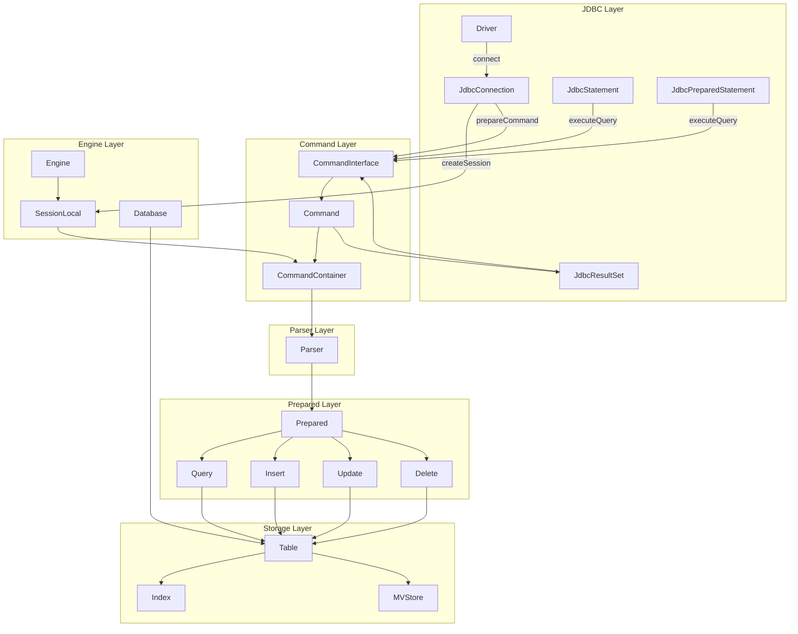
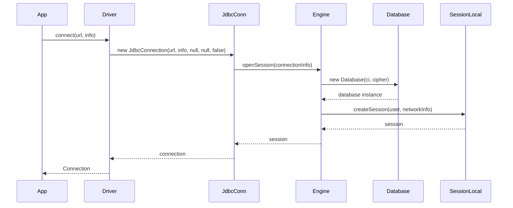
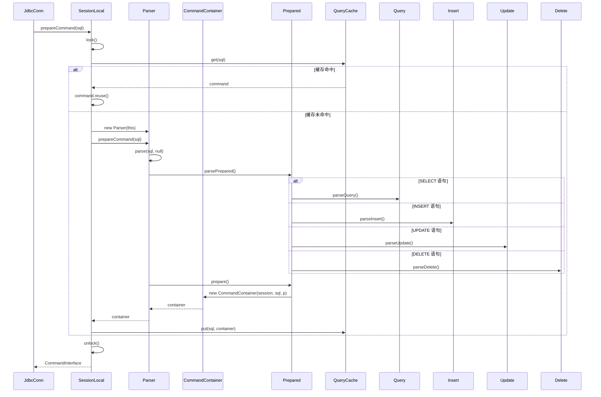
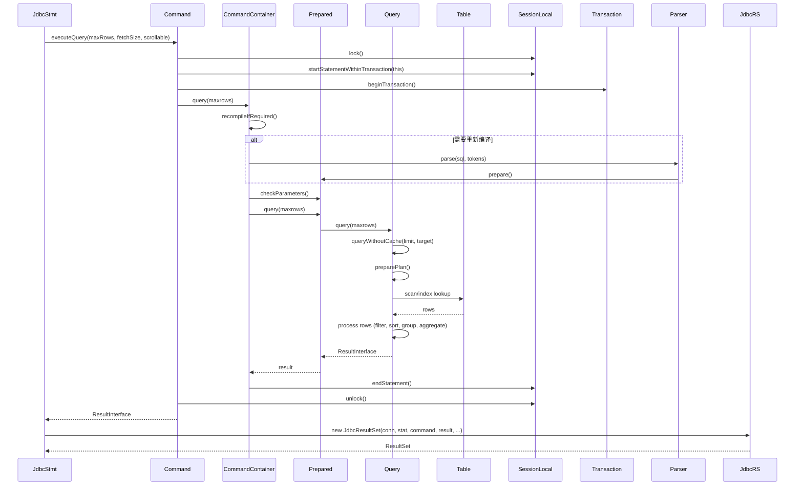
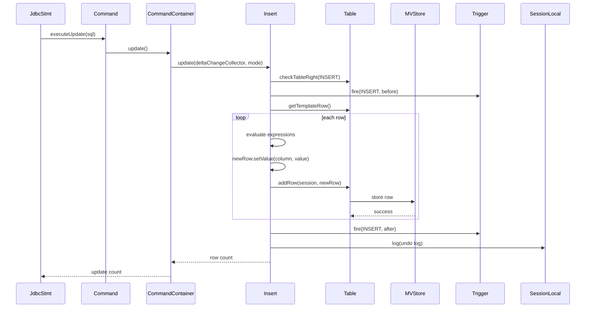
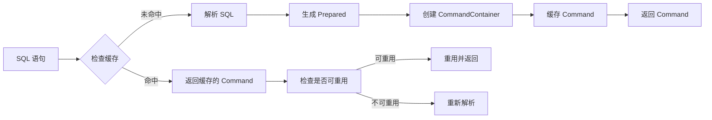
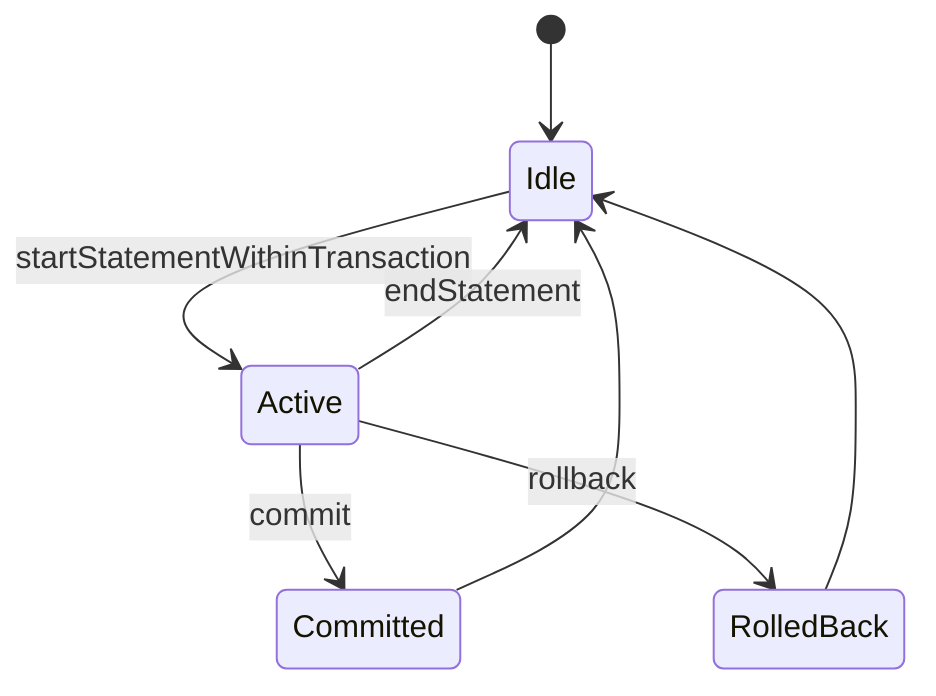
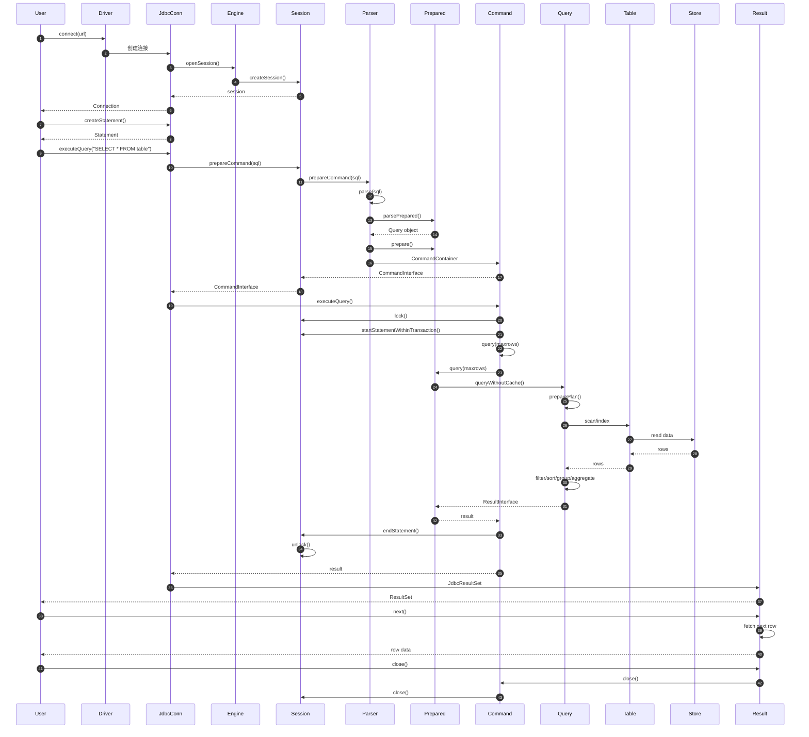

# H2 Database SQL 执行流程

本文档基于 H2 Database 源代码，详细梳理了 SQL 语句从入口到结果返回的完整执行流程。

## 一、整体架构

H2 Database 采用分层架构，SQL 执行流程涉及以下几个主要层次：

## 二、SQL 执行详细流程

### 2.1 阶段一：连接建立

**关键代码位置：**

- **Driver.connect()** - `h2/src/main/org/h2/Driver.java:44`
- **JdbcConnection 构造函数** - `h2/src/main/org/h2/jdbc/JdbcConnection.java:144`
- **Engine.openSession()** - `h2/src/main/org/h2/engine/Engine.java:76`

### 2.2 阶段二：SQL 解析与编译

**关键代码位置：**

- **JdbcConnection.prepareCommand()** - `h2/src/main/org/h2/jdbc/JdbcConnection.java:1160`
- **SessionLocal.prepareCommand()** - `h2/src/main/org/h2/engine/SessionLocal.java:560`
- **SessionLocal.prepareLocal()** - `h2/src/main/org/h2/engine/SessionLocal.java:619`
- **Parser.prepareCommand()** - `h2/src/main/org/h2/command/Parser.java:298`
- **Parser.parse()** - `h2/src/main/org/h2/command/Parser.java:368`
- **Prepared.prepare()** - `h2/src/main/org/h2/command/Prepared.java:238`

### 2.3 阶段三：SQL 执行（以 SELECT 为例）

**关键代码位置：**

- **JdbcStatement.executeQuery()** - `h2/src/main/org/h2/jdbc/JdbcStatement.java:87`
- **Command.executeQuery()** - `h2/src/main/org/h2/command/Command.java:137`
- **CommandContainer.query()** - `h2/src/main/org/h2/command/CommandContainer.java:127`
- **Query.query()** - `h2/src/main/org/h2/command/query/Query.java:236`

### 2.4 阶段四：DML 执行（以 INSERT 为例）

**关键代码位置：**

- **Insert.update()** - `h2/src/main/org/h2/command/dml/Insert.java:87`
- **Table.addRow()** - `h2/src/main/org/h2/table/Table.java`
- **MVStore 相关** - `h2/src/main/org/h2/mvstore/` 目录

## 三、核心类说明

### 3.1 JDBC 层

| 类名 | 文件路径 | 职责 |
|------|----------|------|
| `Driver` | `h2/src/main/org/h2/Driver.java` | JDBC 驱动入口，实现 `java.sql.Driver` 接口 |
| `JdbcConnection` | `h2/src/main/org/h2/jdbc/JdbcConnection.java` | JDBC 连接实现 |
| `JdbcStatement` | `h2/src/main/org/h2/jdbc/JdbcStatement.java` | JDBC 语句实现 |
| `JdbcPreparedStatement` | `h2/src/main/org/h2/jdbc/JdbcPreparedStatement.java` | JDBC 预编译语句实现 |
| `JdbcResultSet` | `h2/src/main/org/h2/jdbc/JdbcResultSet.java` | JDBC 结果集实现 |

### 3.2 命令层

| 类名 | 文件路径 | 职责 |
|------|----------|------|
| `CommandInterface` | `h2/src/main/org/h2/command/CommandInterface.java` | 命令接口 |
| `Command` | `h2/src/main/org/h2/command/Command.java` | 命令基类，处理事务和重试逻辑 |
| `CommandContainer` | `h2/src/main/org/h2/command/CommandContainer.java` | 命令容器，封装 `Prepared` 对象 |

### 3.3 解析层

| 类名 | 文件路径 | 职责 |
|------|----------|------|
| `Parser` | `h2/src/main/org/h2/command/Parser.java` | SQL 词法分析和语法分析 |

### 3.4 准备语句层

| 类名 | 文件路径 | 职责 |
|------|----------|------|
| `Prepared` | `h2/src/main/org/h2/command/Prepared.java` | 准备语句基类 |
| `Query` | `h2/src/main/org/h2/command/query/Query.java` | SELECT 查询基类 |
| `Select` | `h2/src/main/org/h2/command/query/Select.java` | SELECT 查询具体实现 |
| `Insert` | `h2/src/main/org/h2/command/dml/Insert.java` | INSERT 语句实现 |
| `Update` | `h2/src/main/org/h2/command/dml/Update.java` | UPDATE 语句实现 |
| `Delete` | `h2/src/main/org/h2/command/dml/Delete.java` | DELETE 语句实现 |

### 3.5 引擎层

| 类名 | 文件路径 | 职责 |
|------|----------|------|
| `SessionLocal` | `h2/src/main/org/h2/engine/SessionLocal.java` | 本地会话，管理命令准备和执行 |
| `Engine` | `h2/src/main/org/h2/engine/Engine.java` | 数据库引擎，负责打开数据库和创建会话 |
| `Database` | `h2/src/main/org/h2/engine/Database.java` | 数据库实例 |
| `Table` | `h2/src/main/org/h2/table/Table.java` | 表定义和操作 |

### 3.6 存储层

| 类名 | 文件路径 | 职责 |
|------|----------|------|
| `MVStore` | `h2/src/main/org/h2/mvstore/MVStore.java` | MVStore 存储引擎 |
| `ResultInterface` | `h2/src/main/org/h2/result/ResultInterface.java` | 结果集接口 |
| `LocalResult` | `h2/src/main/org/h2/result/LocalResult.java` | 本地结果集实现 |
| `LazyResult` | `h2/src/main/org/h2/result/LazyResult.java` | 懒加载结果集 |

## 四、查询缓存机制

H2 Database 实现了查询缓存以提升性能：

**相关代码：** `SessionLocal.prepareLocal()` - `h2/src/main/org/h2/engine/SessionLocal.java:619`

## 五、事务管理

**关键方法：**
- `SessionLocal.startStatementWithinTransaction()` - 开始事务
- `SessionLocal.commit()` - 提交事务
- `SessionLocal.rollback()` - 回滚事务
- `SessionLocal.endStatement()` - 结束语句

## 六、SQL 执行完整时序图

## 七、优化与扩展点

### 7.1 查询优化

H2 Database 使用 `Optimizer` 类来优化查询计划：

- 位置：`h2/src/main/org/h2/command/dml/Optimizer.java`
- 功能：选择最优的表访问顺序和索引

### 7.2 索引机制

- 主索引：表的主键索引
- 次索引：用户创建的索引
- 全文索引：`h2/src/main/org/h2/fulltext/` 目录

### 7.3 触发器

- 位置：`h2/src/main/org/h2/trigger/` 目录
- 支持的触发时机：BEFORE INSERT, AFTER INSERT, BEFORE UPDATE, AFTER UPDATE, BEFORE DELETE, AFTER DELETE

## 八、参考资料

- H2 Database 官方文档：`h2/src/docsrc/html/`
- 源代码结构：`h2/src/main/org/h2/`
- 示例代码：`h2/src/test/org/h2/test/`

## 九、总结

H2 Database 的 SQL 执行流程可以分为以下主要阶段：

1. **连接建立**：通过 JDBC Driver 创建连接和会话
2. **SQL 解析**：Parser 将 SQL 文本解析为抽象语法树（Prepared 对象）
3. **编译/准备**：Prepared 对象进行表达式准备和执行计划生成
4. **执行**：根据语句类型（SELECT/INSERT/UPDATE/DELETE）执行相应操作
5. **结果返回**：将查询结果封装为 JDBC ResultSet 返回给用户

整个流程采用了分层设计，各层职责清晰，便于理解和扩展。查询缓存机制和事务管理机制确保了高性能和数据一致性。