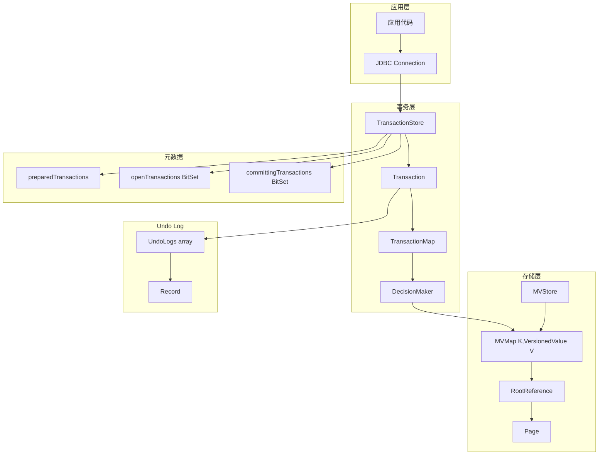
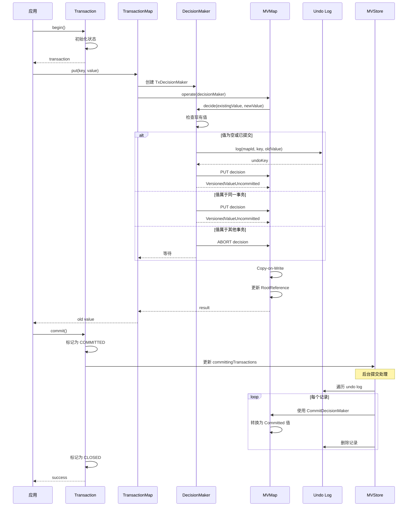

# H2 Database 事务实现详解

## 一、事务概述

H2 Database 的事务实现基于 **MVCC (多版本并发控制)** 和 **Write-Ahead Logging (WAL)** 机制，支持完整的 ACID 特性。

### 1.1 核心设计理念

```
┌─────────────────────────────────────────────────────────────────┐
│                    MVCC + WAL 架构                               │
│                                                                  │
│  MVCC (多版本并发控制):                                          │
│  - 每个事务看到数据的一致快照                                     │
│  - 读操作不阻塞写操作                                             │
│  - 写操作通过版本链实现并发控制                                   │
│                                                                  │
│  WAL (Write-Ahead Logging):                                      │
│  - 数据修改前先写 Undo Log                                       │
│  - 支持事务回滚                                                   │
│  - 保证持久性                                                     │
└─────────────────────────────────────────────────────────────────┘
```

### 1.2 基础实现

- **基于 MVStore**: 使用 MVStore 的多版本 B+Tree 作为存储层
- **VersionedValue**: 每个值都携带事务元数据（事务 ID、操作 ID、版本信息）
- **Undo Log**: 记录修改前的值，用于回滚
- **Snapshot**: 每个事务的快照视图

## 二、核心组件架构

### 2.1 组件关系图



### 2.2 类层次结构

```
TransactionStore (事务存储管理器)
│
├─ Transaction (事务实例)
│  ├─ TransactionMap (事务 Map)
│  │  └─ TxDecisionMaker (决策器)
│  │     ├─ PutIfAbsentDecisionMaker
│  │     ├─ LockDecisionMaker
│  │     └─ RepeatableReadLockDecisionMaker
│  │
│  └─ Snapshot (快照)
│
├─ Record (Undo Log 记录)
│
├─ DecisionMaker (决策器基类)
│  ├─ TxDecisionMaker
│  ├─ CommitDecisionMaker
│  └─ RollbackDecisionMaker
│
└─ VersionedValue (版本化值)
   ├─ VersionedValueCommitted
   └─ VersionedValueUncommitted
```

## 三、详细架构分析

### 3.1 TransactionStore - 事务存储管理器

**职责**: 管理所有事务、Undo Log 和元数据

**核心字段**:
```java
public class TransactionStore {
    final MVStore store;                                    // 底层存储

    // 准备好的事务 (持久化)
    private final MVMap<Integer, Object[]> preparedTransactions;

    // Undo Log 数组 (每个事务一个)
    private final MVMap<Long,Record<?,?>>[] undoLogs;

    // 类型注册表
    private final MVMap<String, DataType<?>> typeRegistry;

    // 事务状态 BitSets
    private final AtomicReference<VersionedBitSet> openTransactions;
    private final AtomicReference<VersionedBitSet> committingTransactions;

    // 事务数组
    private final AtomicReferenceArray<Transaction> transactions;

    // 最大并发事务数
    private static final int MAX_OPEN_TRANSACTIONS = 255;
}
```

### 3.2 Transaction - 事务实例

**职责**: 代表单个事务的生命周期

**核心字段**:
```java
public final class Transaction {
    final TransactionStore store;                          // 所属存储
    final int transactionId;                               // 事务 ID (槽位 ID)
    final long sequenceNum;                                // 序列号 (唯一标识)

    // 状态和日志 ID 的组合字段
    // bit 45: rollback 标志
    // bits 44-41: 状态
    // bit 40: 溢出控制
    // bits 39-0: undo log 最后条目的 logId
    private final AtomicLong statusAndLogId;

    // 快照和计数器
    private MVStore.TxCounter txCounter;
    private RootReference<Long,Record<?,?>>[] undoLogRootReferences;

    // 事务属性
    final IsolationLevel isolationLevel;                   // 隔离级别
    int timeoutMillis;                                     // 超时时间
    final int ownerId;                                     // 拥有者 ID

    // 阻塞控制
    private volatile Transaction blockingTransaction;      // 阻塞的事务
    private volatile boolean notificationRequested;        // 通知请求

    // 事务 Map 映射
    private final Map<Integer, TransactionMap<?,?>> transactionMaps;
}
```

**事务状态**:
```
┌─────────────────────────────────────────────────────────────┐
│                    事务状态机                                │
├─────────────────────────────────────────────────────────────┤
│                                                             │
│   [OPEN] ──┬──→ [PREPARED] ──→ [COMMITTED] ──→ [CLOSED]    │
│      │     │                                              │
│      │     └──→ [ROLLING_BACK] ──→ [ROLLED_BACK]           │
│      │            │                                       │
│      │            └──→ [CLOSED]                           │
│      │                                                     │
│      └──→ [CLOSED]                                        │
│                                                             │
│   状态说明:                                                 │
│   - OPEN: 事务打开，可执行操作                              │
│   - PREPARED: 事务已准备，等待提交                         │
│   - COMMITTED: 事务已提交，可能还有清理工作                 │
│   - CLOSED: 事务完全关闭，资源已释放                       │
│   - ROLLING_BACK: 正在回滚到保存点                         │
│   - ROLLED_BACK: 已回滚，等待清理                          │
│                                                             │
└─────────────────────────────────────────────────────────────┘
```

### 3.3 TransactionMap - 事务 Map

**职责**: 为 Map 提供事务语义

**核心字段**:
```java
public final class TransactionMap<K, V> extends AbstractMap<K,V> {
    // 底层 Map (存储版本化值)
    public final MVMap<K, VersionedValue<V>> map;

    // 关联的事务
    private final Transaction transaction;

    // 快照
    private Snapshot<K,VersionedValue<V>> snapshot;           // 事务快照
    private Snapshot<K,VersionedValue<V>> statementSnapshot;  // 语句快照

    // 决策器
    private final TxDecisionMaker<K,V> txDecisionMaker;
    private final TxDecisionMaker<K,V> ifAbsentDecisionMaker;
    private final TxDecisionMaker<K,V> lockDecisionMaker;
}
```

### 3.4 VersionedValue - 版本化值

**结构**:
```java
public abstract class VersionedValue<T> {
    // 操作 ID (包含事务 ID 和日志 ID)
    public abstract long getOperationId();

    // 条目 ID (用于去重)
    public abstract long getEntryId();

    // 当前值
    public abstract V getCurrentValue();

    // 已提交的值
    public abstract V getCommittedValue();
}
```

**Operation ID 编码**:
```
┌─────────────────────────────────────────────────────────────┐
│                 Operation ID 编码格式                       │
├─────────────────────────────────────────────────────────────┤
│                                                             │
│  63  62  61  60  59  58  57  56  55  54  53  52  51  50  │
│  ┌──────────────────────────────────────────────────────┐  │
│  │              Transaction ID (16 bits)                 │  │
│  └──────────────────────────────────────────────────────┘  │
│                                                             │
│  49  48  47  46  45  44  43  42  41  40  39  38  37  36  │
│  ┌──────────────────────────────────────────────────────┐  │
│  │              Log ID (40 bits)                        │  │
│  └──────────────────────────────────────────────────────┘  │
│                                                             │
│  35  34  33  32  31  30  29  28  27  26  25  24  23  22  │
│  ┌──────────────────────────────────────────────────────┐  │
│  │                    Entry ID                          │  │
│  └──────────────────────────────────────────────────────┘  │
│                                                             │
└─────────────────────────────────────────────────────────────┘

Operation ID 组成:
- Transaction ID: 16 bits (0-65535)
- Log ID: 40 bits (最大 1TB 的操作)
- Entry ID: 去重标识

常量:
- NO_OPERATION_ID = 0: 已提交的值
```

**VersionedValue 类型**:
```
VersionedValue<T> (抽象基类)
│
├─ VersionedValueCommitted<T>
│  └─ 已提交的值，operationId = NO_OPERATION_ID
│
└─ VersionedValueUncommitted<T>
   └─ 未提交的值，包含 operationId
```

### 3.5 Record - Undo Log 记录

**结构**:
```java
final class Record<K,V> {
    final int mapId;                    // Map ID
    final K key;                        // 键
    final VersionedValue<V> oldValue;   // 修改前的值
}
```

**Undo Log 结构**:
```
Undo Log Map for Transaction 5:
┌─────────────────────────────────────────────────────────────┐
│ Key (Operation ID)        │ Value (Record)                  │
├─────────────────────────────────────────────────────────────┤
│ 0x0000000000000005_0000_001 │ mapId=1, key="a", oldValue=V1 │
│ 0x0000000000000005_0001_002 │ mapId=1, key="b", oldValue=V2 │
│ 0x0000000000000005_0002_003 │ mapId=2, key="x", oldValue=V3 │
│ ...                                                              │
└─────────────────────────────────────────────────────────────┘

Key 编码: transactionId (16) | logId (40) | entryId (8)
```

### 3.6 DecisionMaker - 决策器

**职责**: 决定如何处理并发冲突

**类型**:
```
DecisionMaker (MVMap.DecisionMaker)
│
├─ TxDecisionMaker (事务操作决策)
│  ├─ 常规操作
│  ├─ PutIfAbsentDecisionMaker (条件插入)
│  ├─ LockDecisionMaker (加锁操作 - READ_COMMITTED)
│  └─ RepeatableReadLockDecisionMaker (加锁操作 - REPEATABLE_READ)
│
├─ CommitDecisionMaker (提交决策)
│  └─ 将未提交值转换为已提交
│
└─ RollbackDecisionMaker (回滚决策)
   └─ 恢复 Undo Log 中的旧值
```

**决策流程**:
```
TxDecisionMaker.decide(existingValue, providedValue)
        ↓
检查 existingValue
        ↓
    ┌───┴───┬───────────────┬────────────────┐
    ↓       ↓               ↓                ↓
   null  同一事务        已提交           其他事务
    ↓       ↓               ↓                ↓
  创建    记录 Undo    更新为        检查阻塞事务
  新值      Log          新值              ↓
                                         等待/重试/冲突
```

## 四、隔离级别实现

### 4.1 支持的隔离级别

```java
public enum IsolationLevel {
    READ_UNCOMMITTED,      // 读未提交
    READ_COMMITTED,        // 读已提交 (默认)
    REPEATABLE_READ,       // 可重复读
    SNAPSHOT,              // 快照隔离
    SERIALIZABLE           // 可串行化
}
```

### 4.2 隔离级别特性对比

```
┌─────────────────────────────────────────────────────────────────┐
│                    隔离级别特性对比                             │
├───────────────────┬───────────┬───────────┬───────────┬─────────┤
│      隔离级别     │ 脏读(DR)  │ 不可重复读 │  幻读(PR) │  加锁   │
├───────────────────┼───────────┼───────────┼───────────┼─────────┤
│ READ_UNCOMMITTED  │    允许   │   允许    │   允许   │  无锁   │
│ READ_COMMITTED    │   禁止    │   允许    │   允许   │ 短暂锁  │
│ REPEATABLE_READ   │   禁止    │   禁止    │   允许   │ 语句锁  │
│ SNAPSHOT          │   禁止    │   禁止    │   禁止    │ 事务锁  │
│ SERIALIZABLE      │   禁止    │   禁止    │   禁止    │ 事务锁  │
└───────────────────┴───────────┴───────────┴───────────┴─────────┘
```

### 4.3 快照机制

**Snapshot 结构**:
```java
final class Snapshot<K,V> {
    final RootReference<K,V> root;              // Map 根引用
    final long[] committingTransactions;         // 提交中的事务列表
}
```

**快照创建时机**:
```
┌─────────────────────────────────────────────────────────────┐
│                    快照创建时机                              │
├─────────────────────────────────────────────────────────────┤
│                                                             │
│  READ_UNCOMMITTED:                                          │
│    - 每次读取都获取最新快照                                  │
│                                                             │
│  READ_COMMITTED:                                            │
│    - 语句开始时创建快照 (statementSnapshot)                 │
│                                                             │
│  REPEATABLE_READ:                                           │
│    - 事务开始时创建快照 (snapshot)                          │
│    - 整个事务使用同一快照                                    │
│                                                             │
│  SNAPSHOT / SERIALIZABLE:                                    │
│    - 事务开始时创建快照                                      │
│    - 使用 MVStore 版本机制                                    │
│                                                             │
└─────────────────────────────────────────────────────────────┘
```

## 五、事务操作流程

### 5.1 写操作流程

```
Client: transactionMap.put(key, value)
        ↓
TransactionMap.put()
        ↓
检查事务状态
        ↓
创建 TxDecisionMaker
        ↓
MVMap.operate(decisionMaker)
        ↓
TxDecisionMaker.decide(existingValue, providedValue)
        ↓
    ┌───┴───┬───────────┬────────────────┐
    ↓       ↓           ↓                ↓
  null  同一事务    已提交          其他事务
    ↓       ↓           ↓                ↓
创建   记录 Undo  更新          检查状态
新值     Log       新值          ↓
                                已提交? → 更新
                                未提交? → 阻塞/等待
        ↓
TxDecisionMaker.selectValue()
        ↓
创建 VersionedValueUncommitted(undoKey, newValue, lastValue, entryId)
        ↓
MVMap 更新页面 (Copy-on-Write)
        ↓
更新 RootReference
        ↓
返回结果
```

### 5.2 读操作流程

```
Client: transactionMap.get(key)
        ↓
TransactionMap.get()
        ↓
获取快照 (根据隔离级别)
        ↓
MVMap.get(key)
        ↓
读取 VersionedValue
        ↓
检查操作 ID
        ↓
    ┌───┴───┬───────────┬────────────────┐
    ↓       ↓           ↓                ↓
NO_OP_ID  同一事务    已提交          其他事务
    ↓       ↓           ↓                ↓
 返回     返回        返回          检查状态
 值       值         值            ↓
                              已提交? → 返回
                              提交中? → 返回
                              未提交? → 跳过/返回旧值
        ↓
返回结果
```

### 5.3 提交流程

```
Client: transaction.commit()
        ↓
检查事务状态
        ↓
标记为 COMMITTED (statusAndLogId)
        ↓
添加到 committingTransactions BitSet
        ↓
    ┌─────────────────────────────────────────┐
    │         后台提交处理                      │
    ├─────────────────────────────────────────┤
    │  1. 遍历 Undo Log                       │
    │  2. 对每个条目使用 CommitDecisionMaker  │
    │  3. 将 VersionedValueUncommitted       │
    │     转换为 VersionedValueCommitted     │
    │  4. 删除 Undo Log 条目                 │
    │  5. 更新元数据                         │
    └─────────────────────────────────────────┘
        ↓
从 openTransactions 移除
        ↓
从 committingTransactions 移除
        ↓
释放事务槽位
        ↓
通知等待的事务
        ↓
标记为 CLOSED
```

### 5.4 回滚流程

```
Client: transaction.rollback()
        ↓
检查事务状态
        ↓
标记为 ROLLING_BACK
        ↓
    ┌─────────────────────────────────────────┐
    │         回滚处理                          │
    ├─────────────────────────────────────────┤
    │  1. 获取 Undo Log                        │
    │  2. 从后向前遍历 (LIFO)                  │
    │  3. 对每个条目使用 RollbackDecisionMaker │
    │  4. 恢复 oldValue                       │
    │  5. 删除 Undo Log 条目                 │
    │  6. 通知监听器                          │
    └─────────────────────────────────────────┘
        ↓
标记为 ROLLED_BACK
        ↓
清理资源
        ↓
标记为 CLOSED
```

### 5.5 保存点流程

```
Client: transaction.setSavepoint("sp1")
        ↓
记录当前 logId
        ↓
保存到 savepoints Map

Client: transaction.rollbackToSavepoint("sp1")
        ↓
获取保存点的 logId
        ↓
标记为 ROLLING_BACK
        ↓
从保存点 logId 开始回滚
        ↓
恢复到保存点状态
        ↓
删除保存点之后的记录
```

## 六、并发控制

### 6.1 阻塞检测

```
┌─────────────────────────────────────────────────────────────┐
│                    阻塞检测机制                              │
├─────────────────────────────────────────────────────────────┤
│                                                             │
│  TX1 尝试修改 key="A"                                      │
│      ↓                                                      │
│  发现 key="A" 被 TX2 持有 (未提交)                          │
│      ↓                                                      │
│  TX1 记录: blockingTransaction = TX2                        │
│      ↓                                                      │
│  TX1 设置: notificationRequested = true                     │
│      ↓                                                      │
│  TX1 等待 TX2 提交或回滚                                    │
│      ↓                                                      │
│  TX2 提交时检查 notificationRequested                       │
│      ↓                                                      │
│  TX2 通知 TX1 唤醒                                          │
│      ↓                                                      │
│  TX1 重试操作                                               │
│                                                             │
└─────────────────────────────────────────────────────────────┘
```

### 6.2 死锁检测

```
H2 使用超时机制避免死锁:

TX1 持有 key="A", 等待 key="B"
TX2 持有 key="B", 等待 key="A"

如果超过 timeoutMillis (默认 0，无等待):
    → 抛出 MVStoreException: 锁超时
    → 事务回滚
```

### 6.3 事务槽位管理

```
transactions 数组 (MAX_OPEN_TRANSACTIONS = 256):
┌─────────────────────────────────────────────────────────────┐
│  0   1   2   3   4   5   6   7   8   9  ...  254  255    │
│ ┌───┬───┬───┬───┬───┬───┬───┬───┬───┬───┬────┬────┐   │
│ │   │TX1│   │TX2│   │   │TX3│   │   │TX4│... │    │   │
│ └───┴───┴───┴───┴───┴───┴───┴───┴───┴───┴────┴────┘   │
│                                                             │
│ openTransactions BitSet:                                    │
│   0   1   2   3   4   5   6   7   8   9  ...              │
│   ┌───┬───┬───┬───┬───┬───┬───┬───┬───┬───┬────┐        │
│   │ 0 │ 1 │ 0 │ 1 │ 0 │ 0 │ 1 │ 0 │ 0 │ 1 │... │        │
│   └───┴───┴───┴───┴───┴───┴───┴───┴───┴───┴────┘        │
│                                                             │
│ committingTransactions BitSet:                              │
│   ┌───┬───┬───┬───┬───┬───┬───┬───┬───┬───┬────┐        │
│   │ 0 │ 0 │ 0 │ 0 │ 0 │ 0 │ 1 │ 0 │ 0 │ 0 │... │        │
│   └───┴───┴───┴───┴───┴───┴───┴───┴───┴───┴────┘        │
│                                                             │
└─────────────────────────────────────────────────────────────┘

分配新事务:
1. 扫描 openTransactions 找到第一个空闲槽位
2. 分配 transactionId = 槽位索引
3. 分配 sequenceNum = 递增计数器
4. 设置 openTransactions[transactionId] = 1
```

## 七、数据流图

### 7.1 完整写事务流程



### 7.2 读操作可见性

```
┌─────────────────────────────────────────────────────────────┐
│                  读操作可见性判断                            │
├─────────────────────────────────────────────────────────────┤
│                                                             │
│  VersionedValue 可见性规则:                                 │
│                                                             │
│  1. operationId == NO_OPERATION_ID                         │
│     → 已提交，可见                                          │
│                                                             │
│  2. transactionId == currentTransactionId                  │
│     → 同一事务，可见                                        │
│                                                             │
│  3. transactionId in committingTransactions                │
│     → 提交中，可见                                          │
│                                                             │
│  4. transactionId is closed                                │
│     → 事务已关闭，根据 undo log 判断                        │
│                                                             │
│  5. transactionId is open                                  │
│     → 其他未提交事务，不可见                                │
│                                                             │
│  6. 检查 undo log (回滚的值)                                │
│     → 跳过已回滚的值                                        │
│                                                             │
└─────────────────────────────────────────────────────────────┘
```

## 八、恢复机制

### 8.1 启动恢复

```
TransactionStore.init()
        ↓
扫描所有 Undo Log Maps (undoLog.xxx)
        ↓
分析 Undo Log 名称确定事务状态
        ↓
    ┌───┴───┬───────────┐
    ↓       ↓           ↓
  已提交  已准备      打开中
    ↓       ↓           ↓
  继续    标记为      回滚
  清理    COMMITTED
        ↓
注册遗留事务
        ↓
状态 = READY
```

### 8.2 恢复策略

```
┌─────────────────────────────────────────────────────────────┐
│                  恢复策略                                    │
├─────────────────────────────────────────────────────────────┤
│                                                             │
│  Undo Log 名称格式:                                         │
│  - undoLog.-5   : 已提交事务 5                              │
│  - undoLog.5    : 打开中的事务 5                            │
│                                                             │
│  状态判断:                                                  │
│  1. 检查 preparedTransactions Map                           │
│  2. 检查 undoLog 名称                                       │
│  3. 检查 undoLog 最后条目                                   │
│                                                             │
│  恢复操作:                                                  │
│  - COMMITTED: 后台完成清理                                  │
│  - PREPARED: 标记为 COMMITTED，后台清理                     │
│  - OPEN: 回滚事务                                           │
│                                                             │
└─────────────────────────────────────────────────────────────┘
```

## 九、性能优化

### 9.1 无锁读

```
所有读操作都使用快照，不需要加锁:

MVMap.get(key)
    → 获取 RootReference (volatile read)
    → 遍历 B+Tree
    → 读取 VersionedValue
    → 判断可见性
    → 返回结果

无锁读的优势:
- 多个读操作可以并发执行
- 读操作不阻塞写操作
- 写操作不阻塞读操作
```

### 9.2 批量提交

```
提交处理是批量的:

1. 遍历 Undo Log 中的所有条目
2. 批量更新 Map 中的条目
3. 一次性删除 Undo Log
4. 批量更新元数据

这减少了:
- Map 的版本切换次数
- RootReference 的更新次数
- 文件 I/O 操作
```

### 9.3 懒清理

```
已提交事务的 Undo Log 不会立即删除:

COMMITTED 状态:
    - transactionId 不能重用
    - Undo Log 条目存在
    - 后台线程逐步清理

CLOSED 状态:
    - 事务槽位释放
    - Undo Log 清理完成
    - transactionId 可以重用
```

## 十、关键源码位置

| 类/接口 | 文件路径 | 职责 |
|---------|----------|------|
| `TransactionStore` | `h2/src/main/org/h2/mvstore/tx/TransactionStore.java` | 事务存储管理器 |
| `Transaction` | `h2/src/main/org/h2/mvstore/tx/Transaction.java` | 事务实例 |
| `TransactionMap` | `h2/src/main/org/h2/mvstore/tx/TransactionMap.java` | 事务 Map |
| `Record` | `h2/src/main/org/h2/mvstore/tx/Record.java` | Undo Log 记录 |
| `TxDecisionMaker` | `h2/src/main/org/h2/mvstore/tx/TxDecisionMaker.java` | 事务决策器 |
| `CommitDecisionMaker` | `h2/src/main/org/h2/mvstore/tx/CommitDecisionMaker.java` | 提交决策器 |
| `RollbackDecisionMaker` | `h2/src/main/org/h2/mvstore/tx/RollbackDecisionMaker.java` | 回滚决策器 |
| `Snapshot` | `h2/src/main/org/h2/mvstore/tx/Snapshot.java` | 快照 |
| `VersionedValue` | `h2/src/main/org/h2/value/VersionedValue.java` | 版本化值 |
| `IsolationLevel` | `h2/src/main/org/h2/engine/IsolationLevel.java` | 隔离级别 |

## 十一、总结

H2 Database 事务实现的核心特点：

1. **MVCC 实现**: 通过 VersionedValue 和 Undo Log 实现多版本并发控制
2. **无锁读**: 所有读操作使用快照，完全无锁
3. **完整隔离级别**: 支持从读未提交到可串行化的所有隔离级别
4. **写前日志**: 通过 Undo Log 保证原子性和回滚能力
5. **高效并发**: 通过 BitSets 和原子操作实现高效的并发控制
6. **容错恢复**: 完善的恢复机制处理未完成的事务

事务系统是 H2 Database 高性能和高可靠性的重要保障，其设计充分利用了 MVStore 的多版本特性和无锁并发能力。